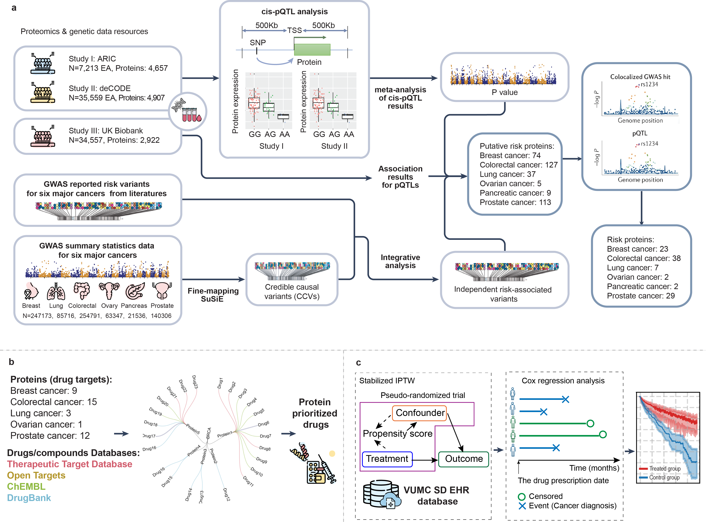

# User' Manual
## Overview
In this work, we integrate large GWAS data for breast, colorectal, lung, ovarian, pancreatic, and prostate cancers and population-sale proteomics data from 96,991 participants combing from Atherosclerosis Risk in Communities study (ARIC), deCODE genetics, and UK Biobank Pharma Proteomics Project (UKB-PPP) to identify risk proteins associated with each cancer. We prioritize therapeutic drugs for potential repurposing based on druggable risk proteins targeted by approved drugs or undergoing clinical trials for cancer treatment or other indications. We further evaluate the effect of cancer risk for those drugs approved for the indications, using over 3.5 million EHR database at Vanderbilt University Medical Center (VUMC). Findings from this study offers novel insights into therapeutic drugs targeting risk proteins for cancer prevention and intervention.



**Step1:** Identify the most significant genetic variants associated with six cancer types (breast, ovary, prostate, colorectum, lung, and pancreas) using the latest GWAS data. Perform statistical fine-mapping to pinpoint the lead variants at each risk locus for each cancer type. Integrate GWAS and Fine-mapping results to pinpoint independent cancer risk variants. Map these genetic independent cancer risk variants to pQTLs from ARIC, deCODE, and UKB-PPP, to pinpoint putative cancer risk proteins (*P* < 0.05, Bonferroni correction). Perform colocalization analyses to identify cancer risk proteins with high confidence by evaluating the likelihood of shared causal variants between pQTLs and GWAS.

**Step2:** Annotate the identified cancer risk proteins using drug information from DrugBank, ChEMBL, the Therapeutic Target Database, and OpenTargets. Identify druggable proteins that are either therapeutic targets of approved drugs or are undergoing clinical trials.

**Step3** Utilize electronic health records from VUMC to emulate treated-control drug trials for drugs approved for indications other than cancer. Apply the Inverse Probability of Treatment Weighting framework and use the Cox proportional hazard model to evaluate the cancer risk.

## Methods
### Meta
A fixed effect meta-analyses was applied between pQTLs from ARIC and deCODE to increase the power of pQTLs.
- Executive code: meta_pQTLs.R
- Example files: meta_example_file.tsv

### coloc
A genetic colocalisation analysis of protein expression and cancer risk was conducted to check whether they share common genetic causal variants. Protein with posterior probability (PP.H4) > 0.5 are considered as cancer risk proteins.

- Executive code: coloc_pQTLs_eQTLs_GWAS.R
- Example files:
1) GWAS summary statistics: coloc_breast_dbSNPs_impute_summary_statistic_polyfun.txt
2) pQTLs: coloc_ANXA4.all.pqtls.csv

### SMR+HEIDI
SMR(Summary-data-based Mendelian Randomization) is a method that uses summary data from GWAS and protein QTL studies to test for a causal relationship between protein expression and cancer risk. A protein Bonferroni-adjusted SMR *P* < 0.05 is considered as significant. A followed HEIDI test is performed on significant SMR results to determine if the colocalized signals can be explained by one single causal variant or by multiple causal variants in the locus. HEIDI *P* >= 0.05 (no obvious evidence of heterogeneity of estimated effects or linkage).

- Executive code:
```
/method/smr-1.3.1-linux-x86_64/smr-1.3.1
--bfile /hg19/1kg.chr1.phase3.20130502.Eur
--gwas-summary /BRCA/CA14.rs12048493.smr.ma
--beqtl-summary /BRCA/CA14.rs12048493.smr
--out BRCA.CA14.rs12048493
--target-snp rs12048493 --thread-num 20
```
- Example files:
1) GWAS summary statistics: CA14.rs12048493.smr.ma
2) pQTLs: CA14.rs12048493.smr
3) 1000G reference files (1kg.chr1.phase3.20130502.Eur) are downloaded from [1000G project](https://www.internationalgenome.org/category/genotypes/)

### Inverse probability of treatment weighting (IPTW)
To mimic randomized controlled trials (RCT) to evaluate the focal drug’s effect, we applied the Inverse Probability of Treatment weighting (IPTW) framework to create a pseudo-population wherein confounding variables are evenly distributed between the treated and control groups. In the IPTW framework, individuals are assigned weights based on the inverse of their propensity scores (PS), which represent their probability of being exposed to risk factors or a specific intervention, such as a treated drug, based on their baseline characteristics. We trained a logistic regression propensity score (LR-PS) model with L1 or L2 regularization on patients' treatment assignments Z and covariates, including age, gender, comorbidities, etc. We trained and selected the logistic model (Eq.1) with the highest area under curve (AUC) using a 10-folder cross-validation. We used the selected model to calculate all patient’s stabilized weights (Eq. 2). These weights are used to calculate the standardized mean difference (SMD, Eq.3) of the covariate’s prevalence in treated and control groups. A covariate d is defined as unbalanced if SMD(*d*)>0.1 in IPTW framework (Eqs. 3, 4). A trial is balanced if it contains < 10% unbalanced covariates (Eqs. 5).

The logistic regression is defined as follows (Eq.1):
```math
\log\left(\frac{P(\mathbf{Z}=1)}{1-P(\mathbf{Z}=1)}\right) = \beta_0 + \beta_1 \mathbf{X}_1 + \beta_2 \mathbf{X}_2 + \ldots + \beta_n \mathbf{X}_n
```
where ***Z*** refers to treatment assignment (1 for treated patient group and 0 for control patient group) and ***X***(***X1***,***X2***, ..., ***Xn***) for baseline covariates. The propensity score is defined as  \[ P(\mathbf{Z}=1 | \mathbf{X}) \] and the stabilized IPTW of each individual is calculated as follows:
```math
\mathbf{w} = \frac{\mathbf{Z} \times P(\mathbf{Z}=1)}{P(\mathbf{Z}=1 \mid \mathbf{X})} + \frac{(1 - \mathbf{Z}) \times (1 - P(\mathbf{Z}=1))}{1 - P(\mathbf{Z}=1 \mid \mathbf{X})} (Eq.2)
```


### Cox proportional hazard model


### Figures
- ./Figures/Figure4.tgz
- ./Figures/Figure5.tgz
- ./Figures/FigureS3.tgz

## Contact
Qing Li: qing.li@vumc.org
Qingyuan Song:
Zhijun Yin:
Xingyi Guo: xingyi.guo@vumc.org
